# AnimeSage
Personalized Anime Recommendation System
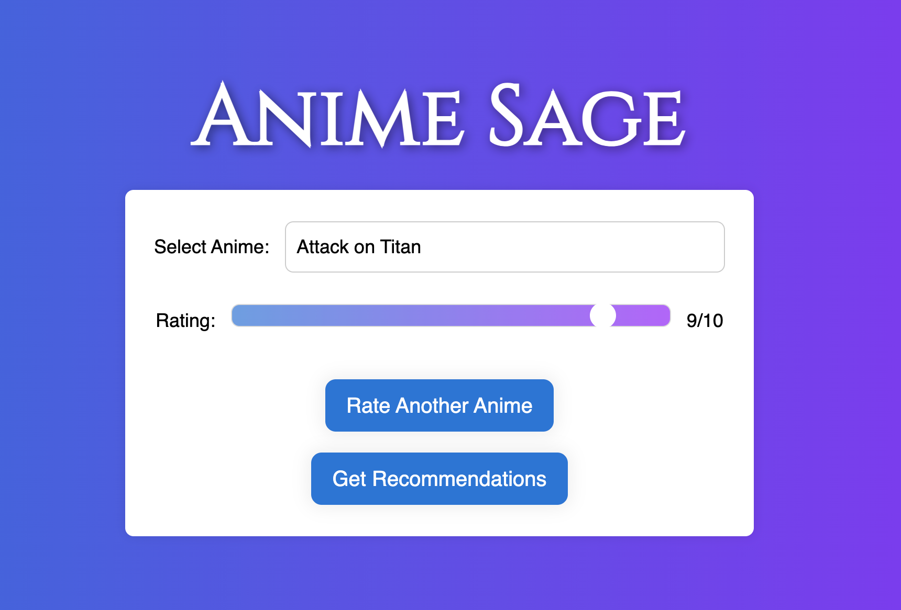

## Project Overview
Anime Sage navigates through the extensive anime universe to deliver tailored recommendations to users. Utilizing data from My Anime List, the project developed a recommendation system that aligns with user preferences by employing an SVD model, achieving an RMSE of 1.16. The system is complemented by a user interface, enabling users to rate anime and receive immediate recommendations. While the current model effectively guides users to suitable anime titles, future iterations aim to explore hybrid models to further refine and personalize recommendations. Anime Sage strives to enable streaming platforms enhance user experience in anime exploration by continually evolving in its recommendation approach.

## Business Problem
There has been a surge in anime's popularity, not only in Japan but globally. Anime is becoming more promenent in consumer culture for both children and adults[^1^].Given the escalating interest and consumption of anime, there is a burgeoning need for sophisticated recommendation systems on streaming platforms to navigate through the expansive anime domain, ensuring users can efficiently discover content that aligns with their preferences and enhances their engagement with the medium[^2^].
This project, born from my own challenges to find useful anime recommendations, aims to simplify this journey by developing a precise recommendation system tailored to individual preferences. In the booming anime industry, this system serves dual purposes: guiding viewers to titles they'll love and providing streaming platforms with a tool to enhance user engagement and potentially increase revenue through personalized content suggestions. The goal is to enrich the anime discovery and viewing experience on platforms, creating a win-win scenario for both viewers and streaming platforms by facilitating more personalized and satisfying content exploration.

## Data Understanding
The recommendation system is built upon data derived from My Anime List, a well-known online platform that provides its users with a comprehensive database of anime, including user ratings, reviews, and recommendations. The datasets utilized for this project can be accessed and reviewed [here](https://github.com/Hernan4444/MyAnimeList-Database). The files used were the anime.csv and rating_complete.csv files within the data folder.

- **Anime Data (`anime.csv`):** This dataset provides a detailed overview of various anime titles available on the platform. It encompasses numerous attributes such as anime ID, name, genre, type (e.g., TV, movie), episodes, rating, and members, among others.
- **User Ratings Data (`rating_complete.csv`):** This dataset includes the user interaction with various anime titles, represented through user IDs, anime IDs, and the respective ratings assigned by the users

## Exploratory Data Analysis

### Numerical Data
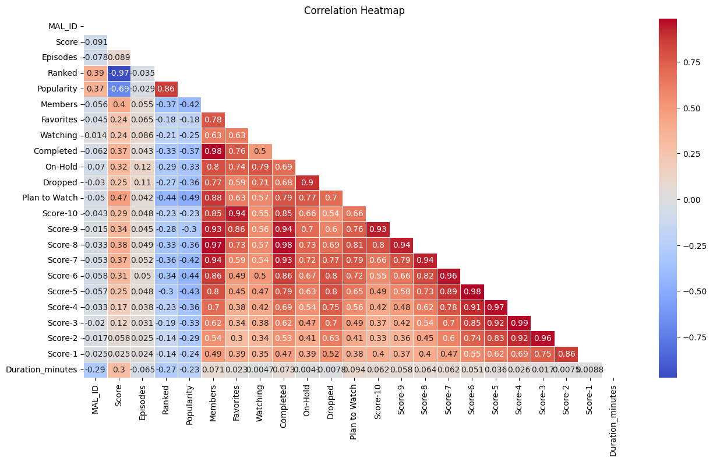
__Insights:__
There are quite a few features that show strong correlations. Lets look more closely at them.
* Score was highly negatively correlated with ranking. This is because ranking is determined by the score (with the exception of rated R18+ not being included in rankings)
* Popularity and ranking are highly correlated. The higher the ranking the more likely people are to have seen it.
* Members and Completed are very highly correlated. It follows that the more people have completed the show, the more members have it on their list.
* It also follows that the more people have the show marked on their list, the more people will have it tagged as 'plan to watch' as well as a higher score of 6-10. It goes along with the idea that the higher scored shows would be watched or planned to watch.
* Favorites also is highly correlated with the higher score columns which is expected. 
* The score columns (1-10) tend to highly correlate with the numerical score column directly above and directly below them. For example score-9 highly correlates with score-8 and score-10 but not with score-4. This makes sense overall a show will score within a certain range.

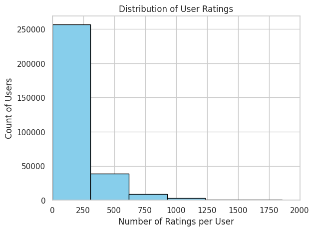

__Insights:__
- **Total Unique Users**: 310,059
- **Average Number of Ratings per User**: Approximately 185.88
- **Maximum Number of Ratings by a Single User**: 15,455
- **Minimum Number of Ratings by a Single User**: 1

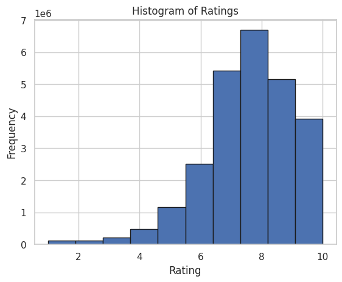

__Insights:__
We can see from the graph that the majority of ratings were higher than five and the median probably falls somewhere between 7 and 8.

### Categorical Data

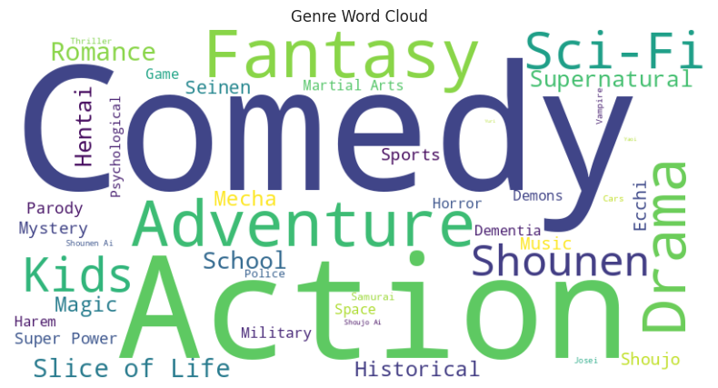
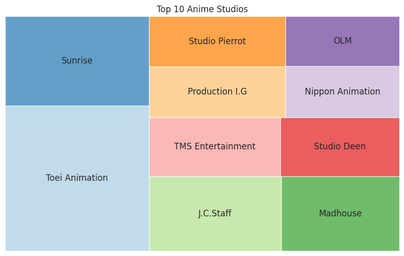
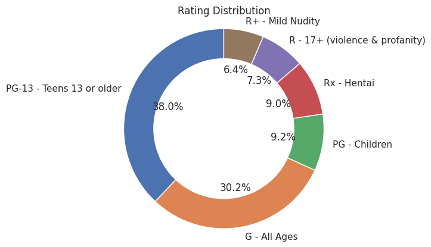

__Insights:__
1. It should come to no surprise for anime lovers that comedy was by far the most listed genre followed by action.
2. Toei Animation dominated in terms of studios with the most anime listed.  
3. Most anime was rated either PG-13, or G.

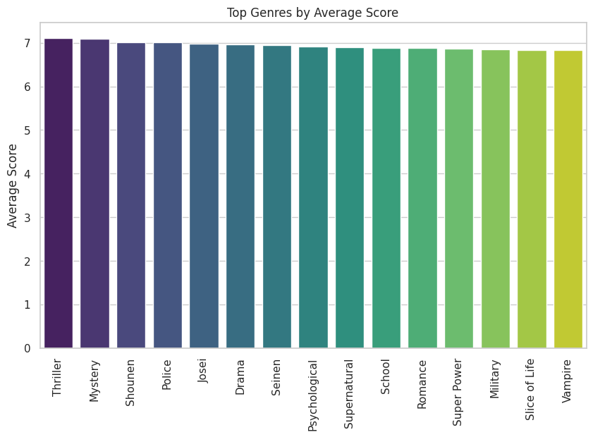

__Insights:__
There were not a lot of differences between the ratings of the highest rated items in the categorical columns. 
There was more of a difference in terms of what seems to be popular but looking at the genres for popularity, it may be more that a few niche animes are generating a lot of popularity so the genre as a whole seems more popular than it actually is (ex. dementia). 

Let's ponder a question: Where should a newcomer to anime begin their journey? Opting for the most popular titles might seem logical, yet popularity doesn't always equate to high quality. On the other hand, while a top-rated anime might be critically acclaimed, its appeal might be niche, making it less suitable for general audiences. Therefore, a balanced approach could be to first identify the most popular animes and then, from that subset, select those with the highest scores.
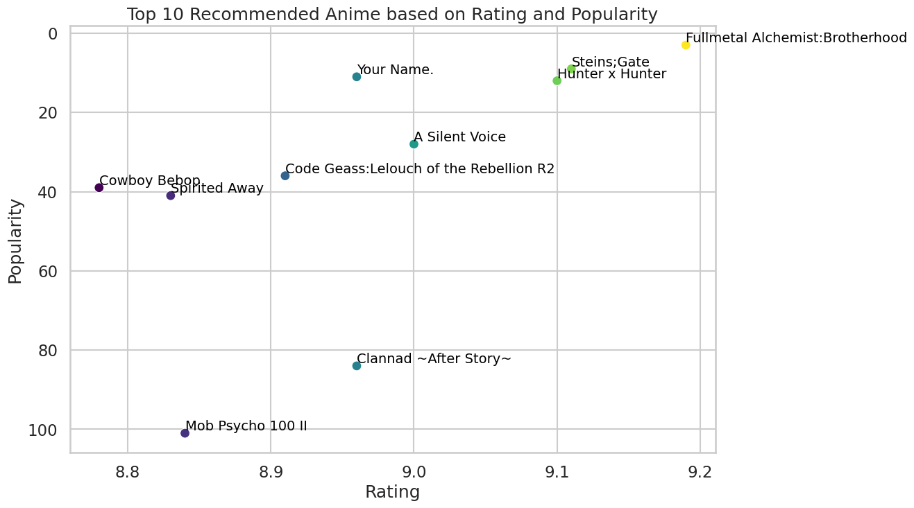

__Top Anime based on Popularity and Rating:__
* Fullmetal Alchemist:Brotherhood
* Steins;Gate
* Hunter x Hunter
* A Silent Voice
* Clannad ~After Story~
* Your Name.
* Code Geass:Lelouch of the Rebellion R2
* Mob Psycho 100 II
* Spirited Away
* Cowboy Bebop

__Insights:__ For an initial solution, especially when we have zero data about a user, these could be reasonable recommendations. It's likely that the recommended anime would be enjoyable for many newcomers, given their widespread popularity and high ratings. However, the ultimate goal is to incorporate personalization as soon as feasible to enhance the user experience.

## Modeling

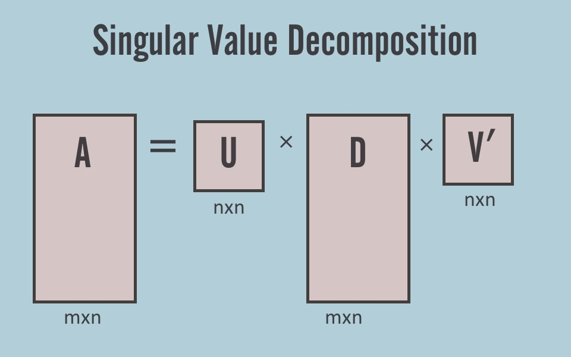

__Algorithm:__
Singular Value Decomposition (SVD) has been widely recognized for its efficacy in recommendation systems, particularly in scenarios involving large datasets with user-item interactions. In the context of my anime recommender system, SVD can be instrumental in deciphering latent features that underline the interactions between users and anime titles.

__How it works:__
Essentially, SVD decomposes the the user-anime ratings matrix into three separate matrices, revealing the hidden features that connect the users and anime in a lower-dimensional space. This enables the prediction of unobserved user-item interactions and allows the system to recommend animes that a user might prefer. For instance, the paper "A music recommendation system based on collaborative filtering and SVD" by Yu-Chuan Chen demonstrates that SVD outperforms item-based collaborative filtering in music recommendations[^3^]. Moreover, the "Rec-CFSVD++: Implementing Recommendation System Using Collaborative Filtering and Singular Value Decomposition (SVD)++" paper illustrates a practical hybrid implementation of SVD++ in a recommendation system, showcasing its capability to predict missing ratings and recommend top-N user-preferred items by leveraging both explicit and implicit feedback[^4^].

## Results and Deployment

The SVD model, configured with parameters `n_factors=20`, `n_epochs=25`, `lr_all=0.005`, `reg_all=0.04`, and `random_state=42`, achieved an RMSE of 1.16. This score, while indicative of a decent model, also highlights room for improvement in predicting user ratings for anime titles. The model successfully navigates through the vast anime space, providing recommendations by identifying patterns in user-item interactions. However, it's worth noting that like any collaborative filtering approach, it has limitations, especially when dealing with new users or items (cold start problem).

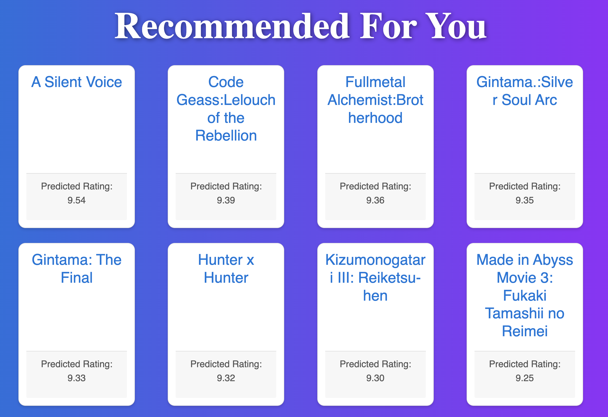

The user interface, crafted to be intuitive and user-friendly, serves as a practical medium for users to interact with the recommendation system. It allows users to rate anime and receive recommendations, thereby creating a dynamic and interactive anime exploration experience.

## Actions for a Streaming Platform
**Recommending Anime on the Streaming Platform:**

* Use highly rated and highly popular anime filter to make solid general recommendations to new users. 
* Transition to SVD model suggestions as soon as users engage.

**Interactive User Engagement:**

* Integrate the interactive application into the main interface.
* Use user interactions with AnimeSage to generate tailored recommendations for users. 

### Next Steps

**Hybrid Model Exploration:**

While the current model provides a solid foundation, exploring a hybrid model that integrates collaborative and content-based filtering could enhance the recommendation quality. The content-based component would utilize anime attributes (e.g., genre, type) to generate recommendations, providing a solution to the cold start problem by ensuring that recommendations can still be made in the absence of user-item interaction data.

***
Thank You!
emmi.galfo@gmail.com
***

## Repository structure: 
├── Photos : images used in readme, presentation, and notebook \
├── AnimeSage : Recommendation app \
├── Exploratory_Data_Analysis.ipynb: jupyter notebook with EDA \
├── Modeling.ipynb: jupyter notebook with modeling and conclusions \
├── README.md : project summary and conclusions \
├── AnimeSage_Presentation.pdf : stakeholder powerpoint slides 

[^1^]Aziz, M., & Ong, S. (2023). The Implementation of Japanese Animation (Anime) In Advertising. Retrieved from https://jiss.publikasiindonesia.id/index.php/jiss/article/download/810/1524.
[^2^]Cho, H., Schmalz, M. L., Keating, S., & Lee, J. H. (2017). Information Needs for Anime Recommendation: Analyzing Anime Users' Online Forum Queries. In Proceedings of the 2017 ACM/IEEE Joint Conference on Digital Libraries (JCDL '17). DOI: 10.1109/JCDL.2017.7991602.
[^3^]: [A music recommendation system based on collaborative filtering and SVD](https://dx.doi.org/10.1109/TOCS56154.2022.10016210)
[^4^]: [Rec-CFSVD++: Implementing Recommendation System Using Collaborative Filtering and Singular Value Decomposition (SVD)++](https://dx.doi.org/10.1142/S0219622021500310)
